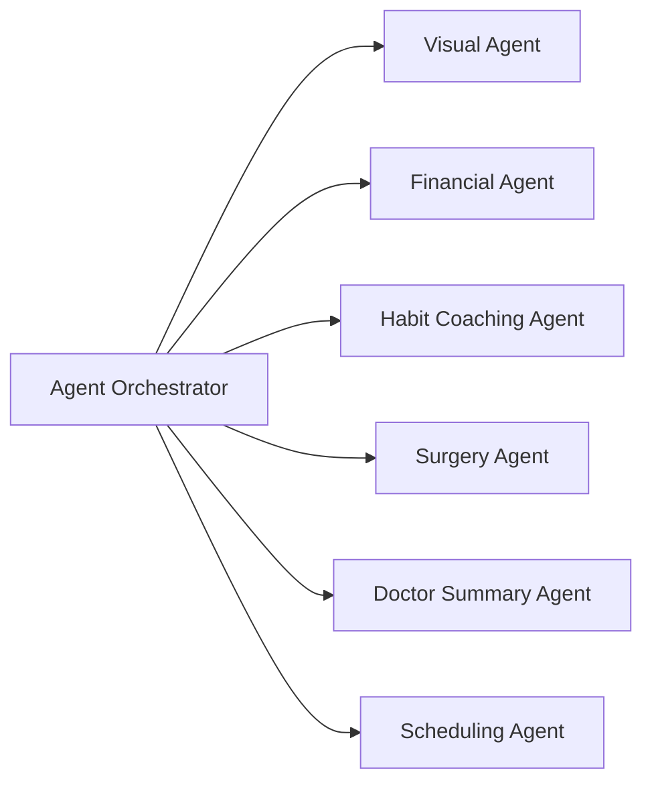

# Align

## Overview

This project is a **multi-agent AI system designed to assist patients and dentists throughout the dental treatment journey**. The platform combines image analysis, treatment prediction, insurance reasoning, habit coaching, and appointment scheduling into a unified workflow.

Patients begin by uploading images of their teeth. A network of specialized AI agents then analyzes the images, predicts potential treatments, suggests hygiene improvements, evaluates insurance coverage options, and helps schedule dental appointments. All outputs are coordinated by a central **Agent Orchestrator**, which compiles results into a clear summary for both the patient and the dentist.

The goal of the system is to make dental care **more proactive, transparent, and personalized**, helping patients understand their treatment path while giving providers better insight before consultations.

---

## Architecture

The system uses an `Agent Orchestrator` to coordinate the six main agents in the dental workflow.



---

## Main agents

**Visual Agent: analyzes uploaded teeth images and identifies visible issues.**


---

**Financial Agent: retrieves and reasons over Sun Life insurance documentation using RAG.**


---

**Habit Coaching Agent: generates personalized hygiene recommendations.**


---

**Surgery Agent: runs a scan of the teeth and shows results.**


---

**Doctor Summary Agent: orchestrates all outputs into a concise provider report.**


---

**Scheduling Agent: pulls dentist information and availability for the user to schedule the next appointment.**


---

## How It Works

1. **User Upload**  
   The patient uploads images of their teeth through the frontend interface.

2. **Visual Analysis**  
   The **Visual Agent** analyzes the images to identify alignment issues, abnormalities, or potential treatment areas.

3. **Treatment Insights**  
   The **Surgery Agent** evaluates the scan results and suggests potential procedures or corrective actions.

4. **Insurance Evaluation**  
   The **Financial Agent** queries Sun Life insurance documentation using **Retrieval-Augmented Generation (RAG)** to determine coverage options and financial recommendations.

5. **Habit Coaching**  
   The **Habit Coaching Agent** provides personalized oral hygiene improvements that can help improve treatment outcomes.

6. **Doctor Summary Generation**  
   The **Doctor Summary Agent** aggregates outputs from all agents and produces a concise diagnostic overview for the dentist.

7. **Appointment Scheduling**  
   The **Scheduling Agent** retrieves dentist availability and suggests appointment times so the patient can move directly from diagnosis to treatment.

The **Agent Orchestrator** coordinates these steps and ensures that information flows correctly between agents.

---

# Dental Multi-Agent Scaffold

Minimal project scaffold for a patient-first dental workflow with:

- `frontend/`: Next.js + React + Tailwind shell
- `backend/`: FastAPI placeholder service

---

## Tech Stack

- **Frontend:** Next.js, React, TailwindCSS  
- **Backend:** Python, FastAPI  
- **AI / LLM:** Google Gemini  
- **Languages:** Python, TypeScript, JavaScript, HTML, CSS  
- **Architecture:** Multi-agent orchestration system with a central Agent Orchestrator  
- **Retrieval:** RAG pipeline with vectorized knowledge base  

---

## Frontend sections

- User upload
- Shared dental model
- Agent orchestrator
- Treatment predictive agent
- Habit coaching agent
- Financial agent
- Clinic locator and scheduling agent
- Monitoring loop
- Final dashboard

---

## Backend placeholder

The FastAPI app is organized into folders for the core workflow:

- `backend/app/pipeline/dental_model/`
- `backend/app/core/`
- `backend/app/agents/treatment_predictive/`
- `backend/app/agents/habit_coaching/`
- `backend/app/agents/financial/`
- `backend/app/agents/clinic_locator/`
- `backend/app/agents/monitoring/`

---

## Available API endpoints

The scaffold currently exposes:

- `GET /`
- `GET /health`
- `GET /pipeline/dental-model`
- `GET /orchestrator`
- `GET /agents/treatment-predictive`
- `GET /agents/habit-coaching`
- `GET /agents/financial`
- `GET /agents/clinic-locator`
- `GET /agents/monitoring`

--- 

## Quickstart

### 1) Backend (FastAPI)
From `backend/`:

```bash
python -m venv .venv
source .venv/bin/activate   # (Windows: .venv\Scripts\activate)
pip install -r requirements.txt
uvicorn app.main:app --reload --port 8000
```

Verify:
- `http://localhost:8000/health`

### 2) Frontend (Next.js)
From `frontend/`:

```bash
npm install
npm run dev
```

Open:
- `http://localhost:3000`

