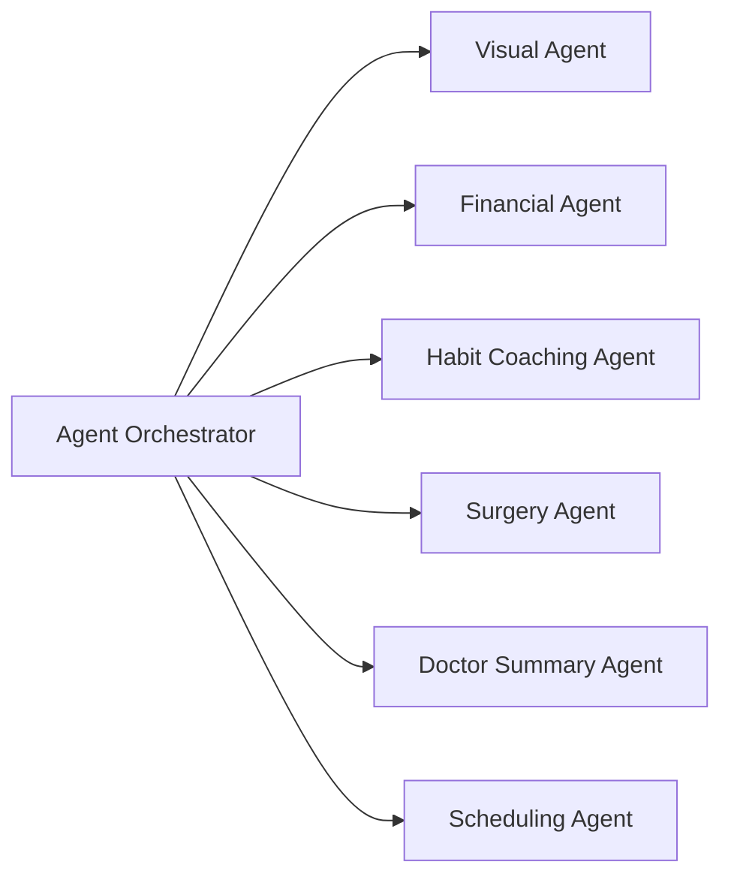

# Dental Multi-Agent Scaffold

Minimal project scaffold for a patient-first dental workflow with:

- `frontend/`: Next.js + React + Tailwind shell
- `backend/`: FastAPI placeholder service

## Frontend sections

- User upload
- Shared dental model
- Agent orchestrator
- Treatment predictive agent
- Habit coaching agent
- Financial agent
- Clinic locator and scheduling agent
- Monitoring loop
- Final dashboard

## Backend placeholder

The FastAPI app is organized into folders for the core workflow:

- `backend/app/pipeline/dental_model/`
- `backend/app/core/`
- `backend/app/agents/treatment_predictive/`
- `backend/app/agents/habit_coaching/`
- `backend/app/agents/financial/`
- `backend/app/agents/clinic_locator/`
- `backend/app/agents/monitoring/`

The scaffold currently exposes:

- `GET /`
- `GET /health`
- `GET /pipeline/dental-model`
- `GET /orchestrator`
- `GET /agents/treatment-predictive`
- `GET /agents/habit-coaching`
- `GET /agents/financial`
- `GET /agents/clinic-locator`
- `GET /agents/monitoring`

## Architecture

The system uses an `Agent Orchestrator` to coordinate the six main agents in the dental workflow.

## Main agents

**Visual Agent: analyzes uploaded teeth images and identifies visible issues.**

**Financial Agent: retrieves and reasons over Sun Life insurance documentation using RAG.**

**Habit Coaching Agent: generates personalized hygiene recommendations.**

**Surgery Agent: runs a scan of the teeth and shows results.**

**Doctor Summary Agent: orchestrates all outputs into a concise provider report.**

**Scheduling Agent: pulls dentist information and availability for the user to schedule the next appointment.**

